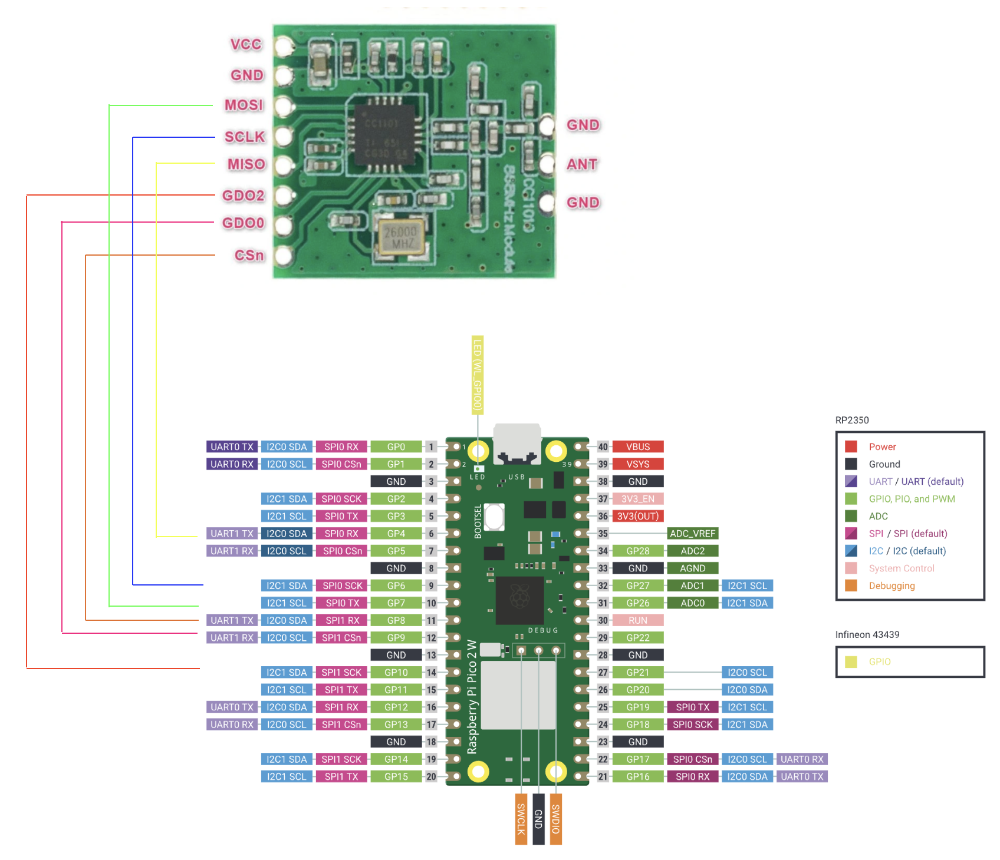

# xComfort direct integration with Home Assistant

This is a proof of concept (PoC) for integrating xComfort switch and dimmer actuators with Home Assistant.
It has been tested with legacy CSAU-01/01 and CDAU-01/01, but it may also work with other similar actuators.

### Key points
- This is a PoC demonstrating the possibility of communicating directly with xComfort devices and integrating them into Home Assistant via MQTT.
- It uses an inexpensive CC1101 transceiver 868.3MHz with a Raspberry Pi Pico W, so no xComfort Communication or Configuration intefaces, xComfort Bridge or Sensio X1 controller required.
- The integration relies on the “Engineering Tool” serial number and a special flag in the telegram, allowing control of xComfort devices without knowing the password or editing the configuration of the existing xComfort installation.
-  This work is a by‑product of [proprietary xComfort protocol study](https://github.com/kuzmin-no/xComfort_vulnerability_disclosure).

NB! Please do not integrate or manage xComfort devices that do not belong to you.

The project is written on MicroPython and uses [MicroPython Asynchronous MQTT](https://github.com/peterhinch/micropython-mqtt) library by Peter Hinch,
as well as ideas from [hatank](https://github.com/rguillon/hatank) by Renaud Guillon.

### Required hardware:
- Transceiver [CC1101 868MHz](https://www.ti.com/lit/ds/symlink/cc1101.pdf)
- Raspberry Pi Pico W

### Connection diagram



| CC1101 | Raspberry Pi Pico W |
|--------|------------|
| MOSI   | GP7 (SPI0 TX) |
| SCK    | GP6 (SPI0 SCK) |
| MISO   | GP4 (SPI0 RX) |
| GDO2   | GP10       |
| GDO0   | GP9        |
| CSN/SS | GP8        |

WiFi and MQTT credentials can be configured in [mqtt.py](src/xComfort/mqtt.py)
The devices can be added in [main.py](src/main.py) using the **devices** dictionary.
All you need is the device’s serial number in decimal format, a name for the device, and a type chosen from **dimmer** or **switch**.

```
devices = {
    1: {
        "serial_number": 2159793,
        "device_name": "xComfort dimming actuator",
        "device_type": "dimmer",
        "object": None
    },
    2: {
        "serial_number": 4390086,
        "device_name": "xComfort switch actuator",
        "device_type": "switch",
        "object": None
    }
} 
```
## Home Assistant

MQTT will create entities using autodiscovery.


The integration device (Raspberry Pi Pico W) will monitor, intercept, and decode messages sent to xComfort devices and will publish the actual state via MQTT.
Therefore, it is important to place the integration device where it has good radio signal reception.
It is also possible to control xComfort device state from Home Assistant, e.g. turning them on/off or setting brightness for dimmer actuators.
